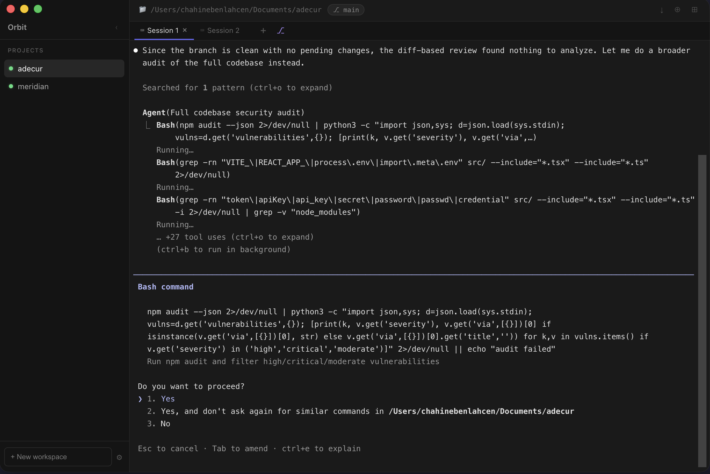

# Orbit

A desktop workspace manager for AI coding CLIs — run isolated sessions per project, with multiple parallel tabs each.

Works with any terminal-based AI tool: [Claude Code](https://claude.ai/code), [Codex CLI](https://github.com/openai/codex), [Gemini CLI](https://github.com/google-gemini/gemini-cli), [Aider](https://aider.chat), or a plain shell.



## What it does

Most AI tools give you one context. Orbit gives you one context **per repo**, each running in a dedicated PTY. Switch between projects without losing context, open parallel sessions in tabs, and keep everything organized in one window.

## Features

- **Workspaces** — add any local folder as a workspace; each gets its own isolated session
- **Tabs** — multiple parallel sessions per workspace (⌘T / ⌘W to open/close, ⌘1–9 to switch)
- **Worktree tabs** — create a git worktree + branch in one click (⎇); each tab runs an isolated clone of the repo so parallel AI agents never conflict
- **Split pane** — split any tab horizontally (⊞) to run two sessions side by side
- **Broadcast input** — send the same keystrokes to all sessions in a workspace simultaneously (⊕)
- **Session resume** — when a session ends, resume it with `--continue` to pick up right where you left off, or restart fresh
- **Context compaction detection** — Orbit watches for Claude Code's auto-compaction notice and shows a ⚡ badge on the tab + a dismissable banner, so you always know when context was trimmed
- **Session history & search** — every session is logged to disk (ANSI-stripped); click 🕐 to browse all past sessions and search across them with full-text
- **Token cost tracking** — accumulated cost per workspace parsed from Claude Code's end-of-session stats and shown live in the header
- **Worktree auto-provisioning** — creating a worktree tab automatically copies `.env` files and runs `npm`/`yarn`/`pnpm install` in the new worktree
- **Session logs** — export the current terminal output to `.txt` (↓)
- **Live git branch** — current branch shown in the header, updates on checkout
- **Tab rename** — double-click any tab to rename it
- **Workspace colors** — click the status dot to cycle through accent colors
- **Drag & drop** — reorder workspaces by dragging
- **Settings** — configure terminal font, font size, and the CLI to run (`claude`, `codex`, `aider`…)
- **Persistent state** — open tabs and active workspace are restored on relaunch
- **Auto-start sessions** — optional setting to automatically spawn all sessions on launch (no clicking through workspaces)
- **Compact sidebar** — collapse the sidebar to icon-only mode (‹/›) to reclaim screen space on small displays
- **Multi-root workspace discovery** — add a parent folder (e.g. `~/GitHub`) and Orbit scans its subdirectories for git repos, letting you bulk-add them in one step
- **Auto-update** — checks GitHub Releases on startup and shows a banner when a new version is available

## Stack

- [Electron](https://www.electronjs.org/) — desktop shell
- [Vite](https://vitejs.dev/) + [React](https://react.dev/) — renderer
- [node-pty](https://github.com/microsoft/node-pty) — PTY process management
- [xterm.js](https://xtermjs.org/) — terminal rendering

## Getting started

```bash
npm install
npm start
```

## Keyboard shortcuts

| Action | Shortcut |
|---|---|
| New tab | ⌘T |
| Close tab | ⌘W |
| Switch to tab 1–9 | ⌘1–9 |

## Settings

Click ⚙ in the sidebar to configure:
- **Font family** — JetBrains Mono, Menlo, Monaco, SF Mono, Fira Code…
- **Font size** — 10–20px, applied live to all open terminals
- **Command** — defaults to `claude`; switch to `codex`, `aider`, `gemini`, `zsh`, or any CLI
